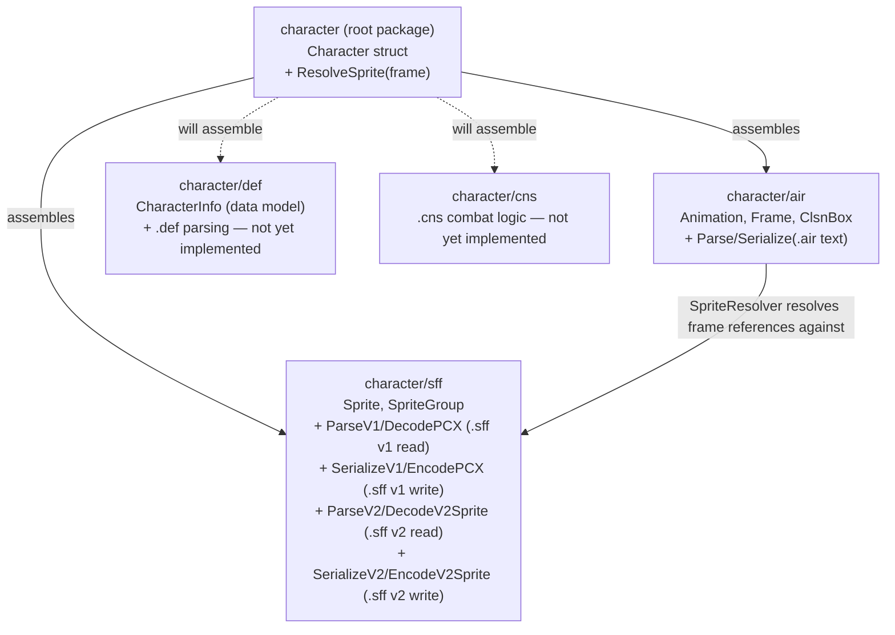

> Generated by /vibe:docs — manual edits will be overwritten; use README for hand-written content.

# Architecture

`character` is a Go module made of a thin root package plus format-specific
sub-packages, one per MUGEN/Ikemen GO file format. The root package
(`character`) assembles the sub-packages into a single `Character` struct —
the unit a library consumer (the `editor` or a future `engine`) actually
wants to work with, rather than raw per-format structs.

## Modules

| Package | Responsibility | Status |
|---|---|---|
| `character` (root) | Assembles the sub-packages into a single `Character{}` struct, and resolves an animation frame to its actual sprite (`ResolveSprite`) | `Animations []air.Animation` and `Sprites []sff.SpriteGroup` wired in; `.def`/`.cns` fields not yet added |
| `character/air` | MUGEN/Ikemen GO animation (`.air`) files: the `Animation`/`Frame`/`ClsnBox` data model, a parser that reads `.air` text into that model, a serializer that writes it back out, a `Document` type for comment-preserving round trips, and a `SpriteResolver` that resolves a `Frame`'s sprite reference against sprites loaded via `character/sff` | Data model + read path implemented; `Serialize` produces valid, re-readable output (not a byte-exact round-trip of an original file's formatting); `Document`/`ParseDocument` round-trip unmodified files byte-for-byte, comments included; `SpriteResolver` resolves every `Frame` reference to its `sff.Sprite`, or a descriptive error for a missing one, regardless of `.sff` version |
| `character/def` | Character definition (`.def`) files — the entry point referencing the other formats: the `CharacterInfo` data model | Data model implemented (`CharacterInfo`: name, author, and referenced file paths); parsing/serialization not yet implemented |
| `character/sff` | Sprite (`.sff`, binary) files: the `Sprite`/`SpriteGroup` data model, a v1 header/sprite-index-table reader (`ParseV1`) and pixel decoder (`DecodePCX`), their write-path counterparts (`SerializeV1`, `EncodePCX`), a v2 header/sprite-and-palette-table reader (`ParseV2`) with its own pixel decoder (`DecodeV2Sprite`), and the v2 write-path counterparts (`SerializeV2`, `EncodeV2Sprite`) | Data model implemented (version-agnostic, no v1/v2-specific fields); v1 read+write cycle implemented (`ParseV1`/`DecodePCX`, `SerializeV1`/`EncodePCX`); v2 header/table reading implemented (`ParseV2`); v2 pixel decoding implemented for raw and PNG-encoded sprites (`DecodeV2Sprite`); v2 write path implemented for the same raw/PNG scope (`SerializeV2`/`EncodeV2Sprite`), completing the v2 read+write cycle for those formats — RLE-based v2 formats (decode and encode) not yet implemented |
| `character/cns` | Combat logic / state machine (`.cns`, text) files | Not yet implemented |

## Read/write separation

Per the project's design constraints, each format package keeps two
sub-concerns apart, even before they become separate files:

- **Read path** — a minimal, stable, pure-data API: the surface a future
  game engine would consume. In `air`, this is `Animation`, `Frame`, and
  `ClsnBox` (no parsing or file I/O in those types), plus the `Parse`
  function that turns `.air` text into them.
- **Write path** — turns the pure-data model back into file text. In `air`,
  `Serialize` produces valid, re-readable `.air` output but always writes
  fresh text, not a byte-exact reproduction of any original file's
  formatting. A separate `Document` type (`ParseDocument` /
  `Document.Serialize`) covers the format-preserving case: it retains the
  original source alongside the decoded `Animation`s, so round-tripping a
  file that wasn't modified reproduces it exactly — comments and ordering
  included. It does not yet regenerate output around an *edited*
  `Animations` slice while keeping unrelated comments intact; that heavier
  reconciliation is deferred until a concrete editing workflow needs it. See
  [`.vibe/decisions/003-air-round-trip-via-separate-document-type.md`](../.vibe/decisions/003-air-round-trip-via-separate-document-type.md).

Because Go only compiles what's imported, a consumer that imports only the
read-oriented parts of a package never pulls in write-only logic — this
gives engine-side isolation without a separate repository.

## Cross-format resolution: air depends on sff

`.air` and `.sff` are interdependent formats, not independent ones: a
`Frame`'s `Group`/`Image` fields are meaningless without a loaded sprite
collection to resolve them against. `character/air` owns this resolution
(`SpriteResolver`, built from `[]sff.SpriteGroup`), so `air` imports `sff` —
matching the dependency this diagram already showed. `sff` itself stays free
of any dependency on `air`, so a consumer that only needs sprite data never
pulls in animation types. See
[`.vibe/decisions/008-air-sprite-resolution-lives-in-air-package.md`](../.vibe/decisions/008-air-sprite-resolution-lives-in-air-package.md).

## Root package assembly

`Character` composes `air.Animation`/`sff.SpriteGroup` values a caller has
already loaded — it does not itself parse `.air`/`.sff` files. Its
`ResolveSprite` method is a thin wrapper around
`air.NewSpriteResolver(c.Sprites).Resolve(frame)`: the frame-to-sprite
lookup logic itself stays owned by `character/air` (see "Cross-format
resolution" above), and the root package only assembles the pieces and
exposes a convenient entry point on `Character`. Only the `air`/`sff`
read-path types (`Animation`, `Frame`, `Sprite`, `SpriteGroup`) are
reachable from `Character` — no write-only, format-preservation type
(e.g. `air.Document`) is exposed.

## A parsing design decision worth knowing

`air.Frame` stores fully-resolved `Clsn1`/`Clsn2` collision box slices — the
boxes actually active on that frame — rather than modeling the `.air`
format's `Clsn1Default`/`Clsn2Default` + per-frame override authoring
mechanism directly in the struct. The parser (`air.Parse`) resolves defaults
and one-shot overrides while reading the file, keeping that resolution
logic out of the pure-data type the read API exposes. See
[`.vibe/decisions/001-frame-clsn-boxes-pre-resolved.md`](../.vibe/decisions/001-frame-clsn-boxes-pre-resolved.md).

`sff.ParseV1` similarly keeps its output out of the public `Sprite`/
`SpriteGroup` model: it returns a separate `V1SpriteTable`/`V1SpriteEntry`
pair carrying file offsets and format-version-specific bookkeeping that
`Sprite` deliberately does not expose. See
[`.vibe/decisions/004-sff-v1-table-is-a-separate-low-level-type.md`](../.vibe/decisions/004-sff-v1-table-is-a-separate-low-level-type.md).
`sff.ParseV2` follows the same pattern for the v2 format, returning
`V2SpriteTable`/`V2SpriteEntry`/`V2PaletteEntry` rather than populating
`Sprite`/`SpriteGroup` directly — v2 additionally needs a palette bank
table, which v1 (single shared or per-sprite palette, no bank indirection)
has no equivalent of.

`sff.DecodePCX` follows the same pattern: it returns a `PCXImage` (pixel
buffer + dimensions), not a populated `Sprite`, since it decodes only the
raw palette-index pixel data — resolving those indices into a `Sprite`'s
`Width`/`Height` and actual colors against a palette is left to a later
assembly step.

`sff.DecodeV2Sprite` returns its own `V2Image`, not `PCXImage`: unlike v1's
always-8-bit-indexed PCX data, v2 sprites can be indexed (raw, PNG8) *or*
direct-color (PNG24, PNG32, no palette involved at all), so `V2Image` tracks
how many bytes each pixel occupies rather than assuming one index byte per
pixel. Only raw and PNG-encoded sprites are decoded today; the real but
less common RLE-based v2 formats return a descriptive "unsupported format"
error rather than being guessed at. See
[`.vibe/decisions/006-sff-v2-pixel-decode-shape-and-scope.md`](../.vibe/decisions/006-sff-v2-pixel-decode-shape-and-scope.md).

On the write side, `sff.SerializeV1` mirrors this with its own write-only
input type, `V1WriteSprite`, rather than reusing `V1SpriteEntry`: a reader's
`Offset`/`Length` are facts computed while parsing a file, not inputs a
writer should trust a caller to supply. Unlike `air`'s `Document` type,
`SerializeV1`/`EncodePCX` do not attempt a byte-exact round trip of an
original file — `.sff` is a binary format with no diff-friendliness benefit
to preserving one, so round-trip fidelity is verified semantically
(serialize, re-parse, re-decode, compare) instead. See
[`.vibe/decisions/005-sff-v1-serialize-is-semantic-not-byte-exact-round-trip.md`](../.vibe/decisions/005-sff-v1-serialize-is-semantic-not-byte-exact-round-trip.md).

`sff.SerializeV2`/`EncodeV2Sprite` follow the same v1 write-path pattern
(their own write-only `V2WriteSprite`/`V2WritePalette` input types, a
semantic rather than byte-exact round trip) with two v2-specific choices:
they always write sprite and palette data into the file's single literal
data section, since `V2SpriteEntry` — the type a caller would round-trip
through this write path — has no field recording which of the format's two
data sections a sprite's bytes originally came from; and `EncodeV2Sprite`
only encodes the same raw/PNG format scope `DecodeV2Sprite` decodes, leaving
the real but unimplemented RLE-based formats as a descriptive error on
write too, for the same reason item 011 gave for not guessing at their
decode side. See
[`.vibe/decisions/007-sff-v2-serialize-shape-and-scope.md`](../.vibe/decisions/007-sff-v2-serialize-shape-and-scope.md).

## No rendering dependency

None of these packages depend on OpenGL, canvas, or any other rendering
backend — they only parse and hold data. This keeps the module compilable
to WebAssembly (`GOOS=js GOARCH=wasm`) for the web editor, and reusable
as-is by a future game engine.
