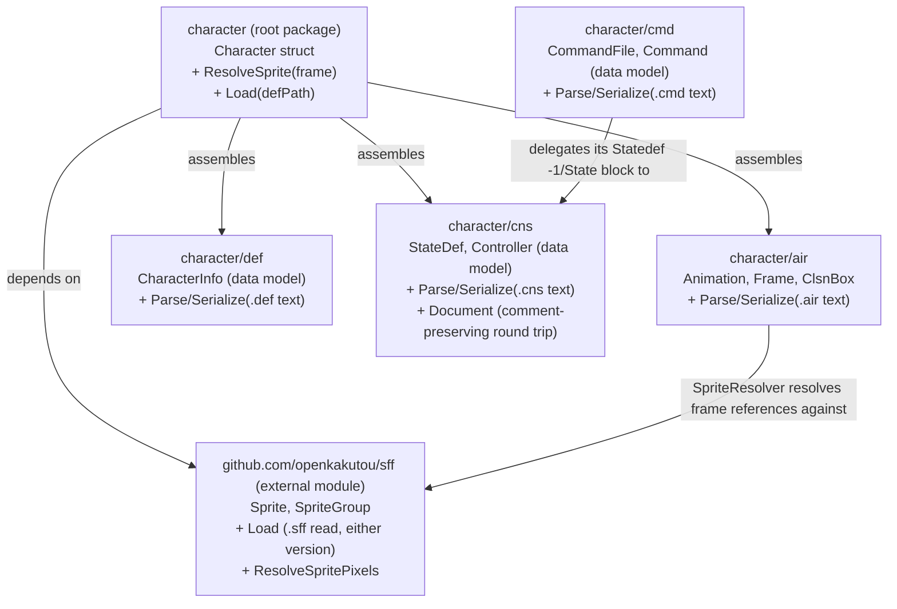

> Generated by /vibe:docs — manual edits will be overwritten; use README for hand-written content.

# Architecture

`character` is a Go module made of a thin root package plus format-specific
sub-packages, one per MUGEN/Ikemen GO file format still owned by this repo,
plus one external dependency for sprite (`.sff`) files. The root package
(`character`) assembles them into a single `Character` struct — the unit a
library consumer (the `editor` or a future `engine`) actually wants to work
with, rather than raw per-format structs.

## Modules

| Package | Responsibility | Status |
|---|---|---|
| `character` (root) | Assembles the sub-packages into a single `Character{}` struct, resolves an animation frame to its actual sprite (`ResolveSprite`), and loads a full `Character` directly from a `.def` file path (`Load`) | `Animations []air.Animation`, `Sprites []sff.SpriteGroup`, and `StateDefs []cns.StateDef` all wired in, via a `.def`-driven top-level loader — completing the full read surface across all four formats; `character/cmd` is implemented but not yet wired in |
| `character/air` | MUGEN/Ikemen GO animation (`.air`) files: the `Animation`/`Frame`/`ClsnBox` data model, a parser that reads `.air` text into that model, a serializer that writes it back out, a `Document` type for comment-preserving round trips, and a `SpriteResolver` that resolves a `Frame`'s sprite reference against sprites loaded via `github.com/openkakutou/sff` | Data model + read path implemented; `Serialize` produces valid, re-readable output (not a byte-exact round-trip of an original file's formatting); `Document`/`ParseDocument` round-trip unmodified files byte-for-byte, comments included; `SpriteResolver` resolves every `Frame` reference to its `sff.Sprite`, or a descriptive error for a missing one, regardless of `.sff` version |
| `character/def` | Character definition (`.def`) files — the entry point referencing the other formats: the `CharacterInfo` data model, a text parser (`Parse`), a serializer (`Serialize`), and a `Document` type for comment-preserving round trips | Data model and read+write cycle implemented (`CharacterInfo`; `Parse` reads `[Info]`/`[Files]` text into it, skipping unrecognized sections; `Serialize` writes it back out to valid, re-readable text; `Document`/`ParseDocument` round-trip unmodified files byte-for-byte, comments and unrecognized sections included); wired into the root `Character` struct via `character.Load` |
| `character/cns` | Combat logic / state machine (`.cns`, text) files: the `StateDef`/`Controller` data model, a text parser (`Parse`) that reads `[Statedef N]`/`[State ...]` blocks into it, keeping trigger conditions and parameters as unevaluated data (and, for `StateDef`'s own numeric and boolean header fields, an unevaluated-expression fallback via `HeaderExprs`), a serializer (`Serialize`) that writes it back out, and a `Document` type for comment-preserving round trips | Data model and read+write cycle implemented; unrecognized sections are skipped by `Parse` rather than aborting the read, matching `def.Parse`'s tolerance; a `[State ...]` header's content is unconstrained (no state number required, matching real-world files) since `Parse` never stores it; `Document`/`ParseDocument` round-trip unmodified files byte-for-byte, comments and unrelated sections included; wired into the root `Character` struct via `character.Load` |
| `character/cmd` | Input command (`.cmd`, text) files: the `CommandFile`/`Command` data model, a text parser (`Parse`) that reads `[Remap]`/`[Defaults]`/`[Command]` sections while delegating the shared `[Statedef -1]`/`[State ...]` block to `cns.Parse`, a serializer (`Serialize`), and a `Document` type for comment-preserving round trips | Data model and read+write cycle implemented; validated against a 520-file real-character corpus (99.8% parse successfully, one pre-existing `cns.Parse` gap tracked separately as item 053); not yet wired into the root `Character` struct |

Sprite (`.sff`, binary) file support is no longer a sub-package of this
repo — it now comes from the separate, independently published
[`github.com/openkakutou/sff`](https://github.com/openkakutou/sff) module,
pinned in `go.mod`, so that other OpenKakutou repos needing sprite parsing
(`stage`, `lifebar`) don't need to depend on this one to get it. This
repo's own docs cover only how `character`/`air` *use* that module
(below); its own internal implementation is documented in its own repo.

## Read/write separation

Per the project's design constraints, each format package keeps two
sub-concerns apart, even before they become separate files:

- **Read path** — a minimal, stable, pure-data API: the surface a future
  game engine would consume. In `air`, this is `Animation`, `Frame`, and
  `ClsnBox` (no parsing or file I/O in those types), plus the `Parse`
  function that turns `.air` text into them.
- **Write path** — turns the pure-data model back into file text. In `air`,
  `Serialize` produces valid, re-readable `.air` output but always writes
  fresh text, not a byte-exact reproduction of any original file's
  formatting. A separate `Document` type (`ParseDocument` /
  `Document.Serialize`) covers the format-preserving case: it retains the
  original source alongside the decoded `Animation`s, so round-tripping a
  file that wasn't modified reproduces it exactly — comments and ordering
  included. It does not yet regenerate output around an *edited*
  `Animations` slice while keeping unrelated comments intact; that heavier
  reconciliation is deferred until a concrete editing workflow needs it. See
  [`.vibe/decisions/003-air-round-trip-via-separate-document-type.md`](../.vibe/decisions/003-air-round-trip-via-separate-document-type.md).

Because Go only compiles what's imported, a consumer that imports only the
read-oriented parts of a package never pulls in write-only logic — this
gives engine-side isolation without a separate repository.

`character/def` applies the same principle at the section level: `.def`
files carry sections beyond `[Info]`/`[Files]` that `CharacterInfo` has no
field for, so `def.Parse` skips them rather than failing outright or
smuggling their content onto the read-path type. Preserving that content —
alongside comments and original section ordering — is instead handled by
`def.Document` (`ParseDocument`/`Document.Serialize`), mirroring `air`'s
`Document` split above: it retains the original source alongside the
decoded `CharacterInfo`, so round-tripping a file that wasn't modified
reproduces it exactly, unrecognized sections included. `def.Serialize`
covers the other case — turning a `CharacterInfo` built or edited in memory
back into fresh, valid `.def` text — but, like `air.Serialize`, does not
attempt a byte-exact reproduction of any original file. See
[`.vibe/decisions/009-def-parse-ignores-unknown-sections.md`](../.vibe/decisions/009-def-parse-ignores-unknown-sections.md).

`character/cns` follows the exact same split as `def` (and, before it,
`air`): `cns.Serialize` turns a `[]StateDef` built or edited in memory back
into fresh, valid `.cns` text — a `Controller`'s `Triggers` are renumbered
`trigger1`, `trigger2`, ... in slice order and its `Parameters` map is
written sorted by key, since neither carries a meaningful original order to
preserve — while `cns.Document` (`ParseDocument`/`Document.Serialize`)
retains the original source bytes alongside the decoded `StateDef`s, so
round-tripping a file that wasn't modified reproduces it exactly —
comments, block ordering, and unrecognized sections included. See
[`.vibe/decisions/003-air-round-trip-via-separate-document-type.md`](../.vibe/decisions/003-air-round-trip-via-separate-document-type.md).

## Cross-format resolution: air depends on sff

`.air` and `.sff` are interdependent formats, not independent ones: a
`Frame`'s `Group`/`Image` fields are meaningless without a loaded sprite
collection to resolve them against. `character/air` owns this resolution
(`SpriteResolver`, built from `[]sff.SpriteGroup`), so `air` imports `sff` —
matching the dependency this diagram already showed. `sff` itself stays free
of any dependency on `air`, so a consumer that only needs sprite data never
pulls in animation types. See
[`.vibe/decisions/008-air-sprite-resolution-lives-in-air-package.md`](../.vibe/decisions/008-air-sprite-resolution-lives-in-air-package.md).

## Cross-format resolution: cmd delegates to cns

`.cmd` and `.cns` share one part of their syntax byte-for-byte: a `.cmd`
file's `[Statedef -1]`/`[State ...]` block — the "always" state that reacts
to a recognized command — is structurally identical to any `.cns`
`[Statedef N]`/`[State N]` block. Rather than reimplementing that parsing a
second time, `character/cmd` calls `cns.Parse`/`cns.Serialize` directly
against the same source text for that part, decoding only its own
`[Remap]`/`[Defaults]`/`[Command]` sections itself. See
[`.vibe/decisions/025-cmd-package-reuses-cns-for-state-triggering-block.md`](../.vibe/decisions/025-cmd-package-reuses-cns-for-state-triggering-block.md).

The command-to-state link itself needs no dedicated modeling: it already
flows through `cns.Controller.Triggers`'s existing unevaluated strings
(e.g. `command = "holdback"`), the same "read-path model can't hold
everything yet" pattern this repo applies throughout.

A real-world corpus scan surfaced one more wrinkle: some `.cmd` files omit
the `[Statedef -1]` header entirely, since `-1` is the only Statedef number
a `.cmd` "always" section can ever use — `cns.Parse` alone has no such
implicit-numbering convention (a bare `.cns` file always requires an
explicit header), so `cmd.Parse` synthesizes it before delegating. See
[`.vibe/decisions/026-cmd-parse-synthesizes-implicit-statedef-minus-1-header.md`](../.vibe/decisions/026-cmd-parse-synthesizes-implicit-statedef-minus-1-header.md).

## Root package assembly

`Character` composes `air.Animation`/`sff.SpriteGroup` values — either
supplied directly by a caller who already loaded them, or read from disk by
the root package's own `Load(path string) (*Character, error)`. `Load` opens
the `.def` file at `path`, parses it with `def.Parse`, resolves the
`.air`/`.sff` paths it references against the directory containing `path`
itself (matching real MUGEN/Ikemen character folder layout), and reads each
with `air.Parse`/`sff.Load` in turn. A missing or unreadable file at any of
those three steps returns a descriptive error naming which file and step
failed, rather than panicking. `Character`'s `ResolveSprite` method is a thin
wrapper around `air.NewSpriteResolver(c.Sprites).Resolve(frame)`: the
frame-to-sprite lookup logic itself stays owned by `character/air` (see
"Cross-format resolution" above), and the root package only assembles the
pieces and exposes convenient entry points on/around `Character`. Only the
`air`/`sff` read-path types (`Animation`, `Frame`, `Sprite`, `SpriteGroup`)
are reachable from `Character` — no write-only, format-preservation type
(e.g. `air.Document`) is exposed. See
[`.vibe/decisions/010-def-loader-assembles-character-from-referenced-files.md`](../.vibe/decisions/010-def-loader-assembles-character-from-referenced-files.md).

## A parsing design decision worth knowing

`air.Frame` stores fully-resolved `Clsn1`/`Clsn2` collision box slices — the
boxes actually active on that frame — rather than modeling the `.air`
format's `Clsn1Default`/`Clsn2Default` + per-frame override authoring
mechanism directly in the struct. The parser (`air.Parse`) resolves defaults
and one-shot overrides while reading the file, keeping that resolution
logic out of the pure-data type the read API exposes. See
[`.vibe/decisions/001-frame-clsn-boxes-pre-resolved.md`](../.vibe/decisions/001-frame-clsn-boxes-pre-resolved.md).

`.sff` parsing internals (`ParseV1`/`ParseV2`, pixel decoding, palette
resolution) used to be documented here in detail, back when `sff` was a
sub-package of this repo. That code — and the design decisions behind its
own low-level types (`V1SpriteTable`, `V2Image`, `PCXImage`, and so on) —
now lives in the separate
[`github.com/openkakutou/sff`](https://github.com/openkakutou/sff) module;
see its own documentation for that level of detail. `.vibe/decisions/004`
through `007`, `014`, and `015` in this repo remain as the historical
record of why `sff` was originally shaped the way it was, from back when
it lived here.

## No rendering dependency

None of these packages depend on OpenGL, canvas, or any other rendering
backend — they only parse and hold data. This keeps the module compilable
to WebAssembly (`GOOS=js GOARCH=wasm`) for the web editor, and reusable
as-is by a future game engine.
