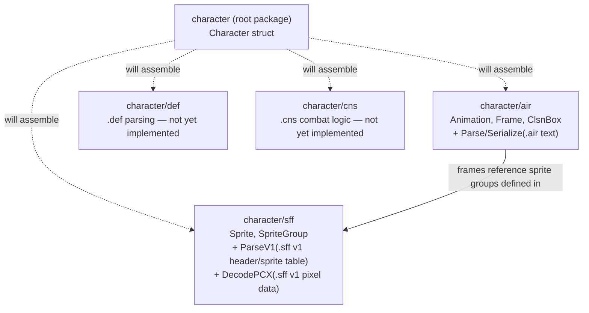

> Generated by /vibe:docs — manual edits will be overwritten; use README for hand-written content.

# Architecture

`character` is a Go module made of a thin root package plus format-specific
sub-packages, one per MUGEN/Ikemen GO file format. The root package
(`character`) assembles the sub-packages into a single `Character` struct —
the unit a library consumer (the `editor` or a future `engine`) actually
wants to work with, rather than raw per-format structs.

## Modules

| Package | Responsibility | Status |
|---|---|---|
| `character` (root) | Assembles the sub-packages into a single `Character{}` struct | Skeleton only (`Name` placeholder field) |
| `character/air` | MUGEN/Ikemen GO animation (`.air`) files: the `Animation`/`Frame`/`ClsnBox` data model, a parser that reads `.air` text into that model, a serializer that writes it back out, and a `Document` type for comment-preserving round trips | Data model + read path implemented; `Serialize` produces valid, re-readable output (not a byte-exact round-trip of an original file's formatting); `Document`/`ParseDocument` round-trip unmodified files byte-for-byte, comments included |
| `character/def` | Character definition (`.def`) files — the entry point referencing the other formats | Not yet implemented |
| `character/sff` | Sprite (`.sff`, binary) files: the `Sprite`/`SpriteGroup` data model, a v1 header/sprite-index-table reader (`ParseV1`), and a v1 pixel decoder (`DecodePCX`) | Data model implemented (version-agnostic, no v1/v2-specific fields); v1 header and sprite index table reading implemented (`ParseV1`); v1 pixel decoding implemented (`DecodePCX`); v2 support not yet implemented |
| `character/cns` | Combat logic / state machine (`.cns`, text) files | Not yet implemented |

## Read/write separation

Per the project's design constraints, each format package keeps two
sub-concerns apart, even before they become separate files:

- **Read path** — a minimal, stable, pure-data API: the surface a future
  game engine would consume. In `air`, this is `Animation`, `Frame`, and
  `ClsnBox` (no parsing or file I/O in those types), plus the `Parse`
  function that turns `.air` text into them.
- **Write path** — turns the pure-data model back into file text. In `air`,
  `Serialize` produces valid, re-readable `.air` output but always writes
  fresh text, not a byte-exact reproduction of any original file's
  formatting. A separate `Document` type (`ParseDocument` /
  `Document.Serialize`) covers the format-preserving case: it retains the
  original source alongside the decoded `Animation`s, so round-tripping a
  file that wasn't modified reproduces it exactly — comments and ordering
  included. It does not yet regenerate output around an *edited*
  `Animations` slice while keeping unrelated comments intact; that heavier
  reconciliation is deferred until a concrete editing workflow needs it. See
  [`.vibe/decisions/003-air-round-trip-via-separate-document-type.md`](../.vibe/decisions/003-air-round-trip-via-separate-document-type.md).

Because Go only compiles what's imported, a consumer that imports only the
read-oriented parts of a package never pulls in write-only logic — this
gives engine-side isolation without a separate repository.

## A parsing design decision worth knowing

`air.Frame` stores fully-resolved `Clsn1`/`Clsn2` collision box slices — the
boxes actually active on that frame — rather than modeling the `.air`
format's `Clsn1Default`/`Clsn2Default` + per-frame override authoring
mechanism directly in the struct. The parser (`air.Parse`) resolves defaults
and one-shot overrides while reading the file, keeping that resolution
logic out of the pure-data type the read API exposes. See
[`.vibe/decisions/001-frame-clsn-boxes-pre-resolved.md`](../.vibe/decisions/001-frame-clsn-boxes-pre-resolved.md).

`sff.ParseV1` similarly keeps its output out of the public `Sprite`/
`SpriteGroup` model: it returns a separate `V1SpriteTable`/`V1SpriteEntry`
pair carrying file offsets and format-version-specific bookkeeping that
`Sprite` deliberately does not expose. See
[`.vibe/decisions/004-sff-v1-table-is-a-separate-low-level-type.md`](../.vibe/decisions/004-sff-v1-table-is-a-separate-low-level-type.md).

`sff.DecodePCX` follows the same pattern: it returns a `PCXImage` (pixel
buffer + dimensions), not a populated `Sprite`, since it decodes only the
raw palette-index pixel data — resolving those indices into a `Sprite`'s
`Width`/`Height` and actual colors against a palette is left to a later
assembly step.

## No rendering dependency

None of these packages depend on OpenGL, canvas, or any other rendering
backend — they only parse and hold data. This keeps the module compilable
to WebAssembly (`GOOS=js GOARCH=wasm`) for the web editor, and reusable
as-is by a future game engine.
